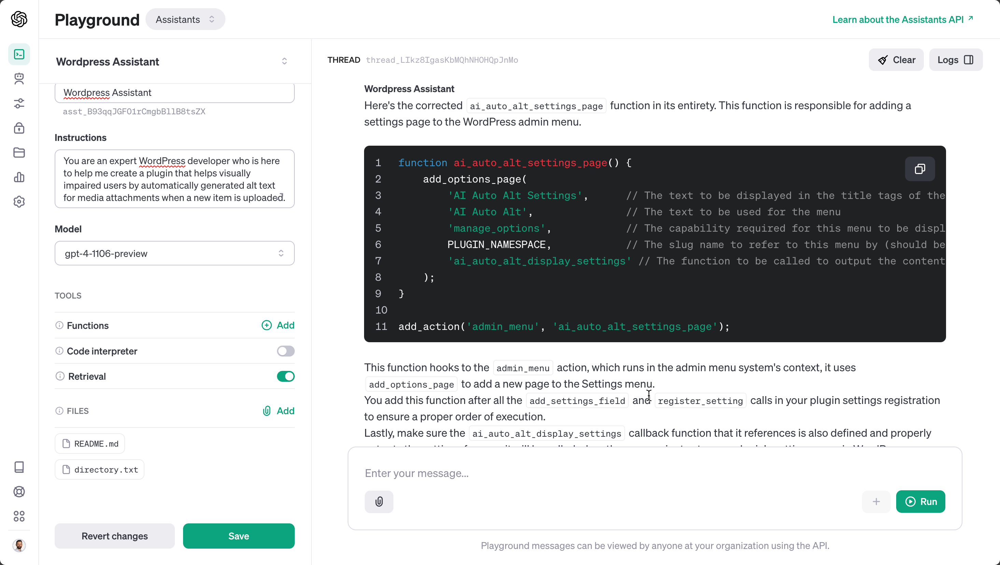

# AI Auto Alt

## Introduction

This is a simple Wordpress plugin to use OpenAI to generate alt text for images. It uses the [OpenAI API](https://platform.openai.com/) to generate the alt text. The plugin is currently in beta.

You need your own OpenAI API key to use this plugin.

# About this project

I enjoy blogging. I like to make my website relatively accessible, to the extent that I have time and resources, given that I am a full-time dad and a full-time small business owner. I _hate_ writing
alt text, especially when AI is getting so good at it.

For weeks I would paste images into OpenAI's ChatGPT on the web and have it generate alt text, and then
copy and paste it to my WordPress site, always wishing that this was automated. But, I'm not a WordPress
developer, I haven't even used PHP in years.

So I decided to use the tech I wanted to use. I began by asking ChatGPT what a WordPress plugin framework looked like, then I asked it to build out a skeleton file.
A step at a time I had it add the settings for me, and settings page, and then the code to actually call
OpenAI to generate the alt text.

For faster and better assistance, I created an assistant in OpenAI's playground and uploaded select
portions of the code. This increased the quality of the responses. Interestingly, it slowed them
down as well.

You'll notice that there are some extensive comments in the code straight from OpenAI, that is to help
ChatGPT in its responses, as well as GitHub co-pilot. My experience in other development is that
the response quality goes up significantly when you give it a lot of context.

*It was fast* Even simple things that are easily in my skillset went so much faster. In commit `649e2abe3804108ba46694cf5c239e17a30b2aef` I asked OpenAI:

```
Add descriptions in each option here:
[code inserted]
```

and outputted the rest of the diff instantly. 



## Lessons
*Give lots of context* - I found that the quality of the responses went up significantly when I gave
it a lot of context. I would regularly paste in the entire file so it was all in the context window.
I also uploaded the readme.md file to the playground and had it generate the entire file.

*Git is great*  - Being able to examine the diff of the code sped up development significantly because
I could compare the previous code to ChatGPT's response and easily see if it made sense. Kind of like
a PR review..

*It isn't on autopilot yet* - My development experience in other fields and ancient PHP experience was
still more or less required, but it was mostly in the small things, such as OpenAI not properly creating
a JSON object for the API.

# Development

The `dev` directory contains a docker-compose file to run a local Wordpress instance with the plugin
directory mounted. This allows you to develop the plugin locally and see the changes in real time. The
local bind mount is located at `wordpress/wp-content/plugins/ai-auto-alt`.

The rest of the Wordpress directory does not have a local bind mount.

The directoy `dev/data/db` is used to store the database for the local Wordpress instance. It also
has a local bind mount to the container and will persist across restarts. The initial Wordpress
directory is commited to the repository so you can start the local instance without any additional
setup. No other commits to the Wordpress directory should be made.

The initial db commit is copied to `dev/data/db.zip` in case the db folder has a new commit it
wasn't suppose to have.

The Wordpress admin page is at [http://localhost:8080/wp-admin](http://localhost:8000/wp-admin). The login is
`ai-auto-alt:ai-auto-alt`

## Local Debug Mode

If this is set, the file `dev/images/images.md` will be used for an attachment URL instead of the
real uploaded attachment. This allows for local development when public access to the development
environment is not available.

The image URLs are all from Wikimedia Commons and are licensed without restrictions.
