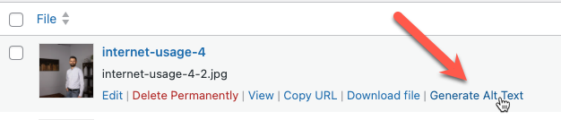
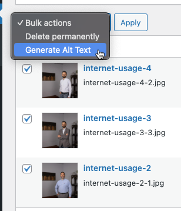

# AI Auto Alt Text

Make your website more accessible to visually impaired users with the AI Auto Alt Text plugin for WordPress. Powered by advanced artificial intelligence, this innovative plugin automatically generates descriptive alt text for images as they're uploaded, ensuring that your content is more inclusive and SEO-friendly.

## Features:

- **Automatic Alt Text Generation**: When an image is uploaded to your media library, AI Auto Alt Text leverages OpenAI's latest models to create accurate and contextually relevant alt descriptions.
- **Support for Multiple Image Types**: The plugin works with various image formats including JPG, PNG, GIF, and more, making it versatile for all your media needs.
- **EXIF Data Analysis**: Gain more meaningful descriptions by using image metadata (EXIF) for an enhanced understanding of each image, when available.
- **Fully Customizable Prompts**: Adjust the AI prompts to tailor alt text generation to your specific needs and the context of your website.
- **Advanced Settings**: Fine-tune the AI response with settings like temperature control, top P value, and max token limit to achieve the desired level of creativity and specificity.
- **Bulk Alt Text Generation**: Generate alt text for  existing images in your media library with a single click.

## Benefits:

- **Improved Accessibility**: Assists visually impaired users by providing detailed image descriptions as they navigate through your site with screen readers.
- **SEO Boost**: Better alt text can improve image searchability and overall SEO performance.
- **Time-saving Automation**: Reduce manual effort in creating alt text for every image — let AI handle it efficiently.
- **Enhanced User Experience**: Provide a richer browsing experience with informative image descriptions, fulfilling the needs of all users.

## How it Works:

Upon activation, the plugin listens for media upload events and utilizes OpenAI's powerful model to generate alt text. It's smart enough to include filename and EXIF data in its analysis for more precise and appropriate alt text suggestions. Options can be set in the plugin's settings page, where you can input your OpenAI API key and adjust various parameters to customize the AI's behavior.

## Getting Started:

1. Install and activate AI Auto Alt Text.
2. Configure your OpenAI API settings in the plugin's settings page.
3. Start uploading images and watch as alt text is automatically generated.

If you view your media library in the list view you will have an option to generate alt text for that media item, or select multiple items and generate alt text for all of them at once.
 



Each image does have to be submitted to OpenAI individually, so it may take a few seconds to generate alt text for each image. If you have a lot of images, you will need to do this in batches.

## Privacy:
This plugin does not store any images or alt text on the server. All image data is processed locally and sent to OpenAI's API for alt text generation.
As of 2023-12-17 OpenAI says that will not store data sent to the API for more than 30 days. [https://openai.com/enterprise-privacy/](https://openai.com/enterprise-privacy/)

## Security:
Reasonable steps have been taken to avoid XSS and SQL injection vulnerabilities. Returned data from OpenAI is sanitized before being displayed. EXIF data is sanitized before being sent to OpenAI.

However, use at your own risk. If you run a site where anybody can upload media this may increase risk.

# About this project

I enjoy blogging. I like to make my website relatively accessible, to the extent that I have time and resources, given that I am a full-time dad and a full-time small business owner. I _hate_ writing
alt text, especially when AI is getting so good at it.

For weeks I would paste images into OpenAI's ChatGPT on the web and have it generate alt text, and then
copy and paste it to my WordPress site, always wishing that this was automated. But, I'm not a WordPress
developer, I haven't even used PHP in years.

So I decided to use the tech I wanted to use. I began by asking ChatGPT what a WordPress plugin framework looked like, then I asked it to build out a skeleton file.
A step at a time I had it add the settings for me, and settings page, and then the code to actually call
OpenAI to generate the alt text.

For faster and better assistance, I created an assistant in OpenAI's playground and uploaded select
portions of the code. This increased the quality of the responses. Interestingly, it slowed them
down as well.

You'll notice that there are some extensive comments in the code straight from OpenAI, that is to help
ChatGPT in its responses, as well as GitHub co-pilot. My experience in other development is that
the response quality goes up significantly when you give it a lot of context.

*It was fast* Even simple things that are easily in my skill-set went so much faster. In commit `649e2abe3804108ba46694cf5c239e17a30b2aef` I asked OpenAI:

```bash
Add descriptions in each option here:
[code inserted]
```

and outputted the rest of the diff instantly.


## Lessons

*Give lots of context* - I found that the quality of the responses went up significantly when I gave
it a lot of context. I would regularly paste in the entire file so it was all in the context window.
I also uploaded the readme.md file to the playground and had it generate the entire file.

*Git is great*  - Being able to examine the diff of the code sped up development significantly because
I could compare the previous code to ChatGPT's response and easily see if it made sense. Kind of like
a PR review..

*It isn't on autopilot yet* - My development experience in other fields and ancient PHP experience was
still more or less required, but it was mostly in the small things, such as OpenAI not properly creating
a JSON object for the API.

# Development

The `dev` directory contains a docker-compose file to run a local Wordpress instance with the plugin
directory mounted. This allows you to develop the plugin locally and see the changes in real time. The
local bind mount is located at `wordpress/wp-content/plugins/ai-auto-alt`.

The rest of the Wordpress directory does not have a local bind mount.

The directory `dev/data/db` is used to store the database for the local Wordpress instance. It also
has a local bind mount to the container and will persist across restarts. The initial Wordpress
directory is committed to the repository so you can start the local instance without any additional
setup. No other commits to the Wordpress directory should be made.

The initial db commit is copied to `dev/data/db.zip` in case the db folder has a new commit it
wasn't suppose to have.

The Wordpress admin page is at [http://localhost:8080/wp-admin](http://localhost:8000/wp-admin). The login is
`ai-auto-alt:ai-auto-alt`

## Local Debug Mode

If this is set, the file `dev/images/images.md` will be used for an attachment URL instead of the
real uploaded attachment. This allows for local development when public access to the development
environment is not available.

The image URLs are all from Wikimedia Commons and are licensed without restrictions.

## Contributing
If you've gotten this far you know how to fork and submit a PR. If you don't want to do that, open an issue
with the adjusted code.

_Either way please be as clear as you can about what you want to change and ***why**._ As mentioned above,
I am  NOT a WordPress developer. Talk to me like I'm a 10th grader.

# Ownership
I do not have significant motivation to maintain this project long term. If you are interested in taking
over ownership, please contact me. 